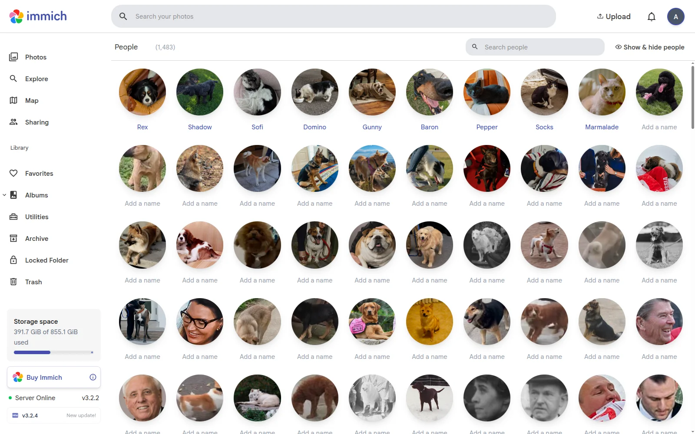
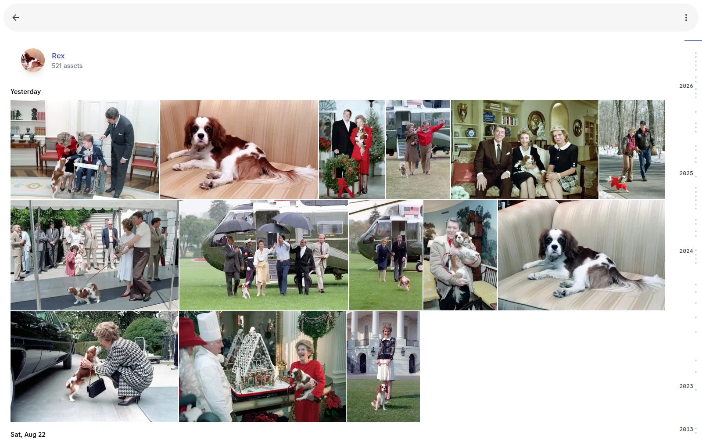

# animal-ml sidecar

Adds your dogs and cats to Immich's **People** tab. Immich already detects human
faces and groups them into people and this adds an additional animal detector on
top of the existing models. Human face detection and recognition should work the
same as before.

Dogs and cats appear as people, mixed in with the humans. There is no separate
animals section.



**Testing in beta: dogs and cats.** Cats are new in 0.3.0. Other animals are not
supported; wolves and foxes are often detected as dogs.

**Use Refresh, not Reset** on the Face Detection queue. Refresh keeps every
face already in your library, so names, merges and hidden people survive both
adding the sidecar and removing it. Reset deletes every detected face first.

## What you need

- Immich running under `docker compose` (v3.0 or newer)
- About 1 GB of disk space

## 1. Add the service

Next to your Immich `docker-compose.yml`, create `docker-compose.override.yml`:

```yaml
services:
  animal-ml:
    container_name: animal_ml
    image: ghcr.io/rtp4jc/animal-ml:0.3.0
    environment:
      UPSTREAM_ML_URL: http://immich-machine-learning:3003
    restart: always
```

```bash
docker compose up -d animal-ml
```

## 2. Point Immich at it

**Administration → Settings → Machine Learning** → set the URL to
`http://animal-ml:3003` and save.

That is the only setting to change. Leave **Min Detection Score** and **Max
Distance** where they are: they are tuned for human faces and still apply to
them. Pets need different values, so the sidecar uses its own thresholds.

## 3. Find the pets

**Administration → Job Queues → Face Detection → Refresh**.

Expect this to take up to several hours depending on the size of your library. 
The full face detection queue must empty before face recognition starts so 
you will not see partial results until the detection queue is empty.

When completed, name and modify a dog or cat the way you would a person!



## What works, what does not

Pets you photograph a lot cluster well. How often a pet ends up as one correct
person, is never grouped, or is merged with another pet from the same home is in
the [model card](../README.md#households).

- **Pets with plenty of photos** get one large cluster plus a few strays to merge
- **Pets with only a handful of photos** may not group at all
- **Similar-looking pets** get mixed together — two black curly-coated dogs, or
  two grey tabbies, are genuinely hard
- **Dogs and cats** are kept apart; a dog and a cat almost never share a person
- **Wolves and foxes** are detected as dogs most of the time

Merging two people in Immich is easy, but splitting one is not, so the defaults
lean towards leaving you a few extra clusters rather than wrongly combining two
pets.

## Turning it off

Point the Machine Learning URL back at `http://immich-machine-learning:3003` and
run **Face Detection → Refresh**. The dog and cat faces will be removed, but
human faces will be untouched. Pet names are not kept, so turning it on again requires
you to add names again.

## Settings

Changing most of these settings are more involved than just enabling or disabling the sidecar 
so I wouldn't suggest it, but here it is if you really want to tweak.

### In the docker container definition
These are the sidecar's settings, not in Immich. 
Add them under `environment:` in the `docker-compose.override.yml` from step 1, then
`docker compose up -d animal-ml` to apply and do **Face Detection → Refresh**.

| Variable | Default | What it does |
| --- | --- | --- |
| `UPSTREAM_ML_URL` | — | Your existing Immich ML container. Required: search and OCR are forwarded to it. |
| `KEEP_HUMAN_FACES` | `true` | `false` serves pets only and stops detecting human faces. A refresh will delete all human face edits you have made |
| `DOG_MIN_SCORE` | `0.3` | How confident the detector must be for a dog. Lower finds more dogs and more wolves and foxes. Just requires a refresh. |
| `DOG_MAX_DISTANCE` | `0.4` | **SEE NOTE BELOW** How alike two dogs must look to count as the same dog. Lower splits more, higher merges more. |
| `CAT_MIN_SCORE` | `0.3` | As `DOG_MIN_SCORE`, for cats. |
| `CAT_MAX_DISTANCE` | `0.35` | As `DOG_MAX_DISTANCE`, for cats, whose embeddings sit closer together. |
| `IMMICH_MAX_DISTANCE` | `0.5` | The Max Distance in your Immich settings. Change only if you changed that. |

**NOTE**: `DOG_MAX_DISTANCE` (and `CAT_MAX_DISTANCE`) is tricky to change. You can't just do a refresh after changing 
it because previously detected faces do not get a new embedding on refresh. If you need to change it, I would suggest 
disabling the sidecar temporarily, refreshing the face detection again (**Face Detection → Refresh**),
then adding the sidecar again with the new configuration and refreshing. This will result in 
only the named pets being lost and the human faces remaining unchanged.

### From Immich UI
Immich's face-model setting only affects people. Pets always use the same
embedder, whatever model is picked there.

## Trouble

**"Machine learning server became unhealthy"** — `animal-ml` is not running, or
not on Immich's docker network. Check `docker logs animal_ml`.

**Search stopped working** — `UPSTREAM_ML_URL` is wrong. Text search is
forwarded to Immich's own ML container.

**No pets at all** — Face Detection was probably run as **Missing**, which only
looks at photos that have never been scanned. Run it as **Refresh**.

**Too many near-duplicate people** — merge them, or raise `DOG_MAX_DISTANCE` to
`0.45` (`CAT_MAX_DISTANCE` to `0.4`) following the note under [Settings](#settings).

---

# Development

The main [README](../README.md) covers the models and training. This section is
only what is specific to the sidecar.

`serve.py` is the whole integration. Immich talks to machine
learning over HTTP, so this needs no fork of Immich and no patched image — just
a service that answers `POST /predict` and `GET /ping` the way Immich expects.

```
immich-server ──▶ animal-ml ──facial-recognition──▶ our ONNX models
                      └──────everything else──────▶ immich-machine-learning
```

It is its own uv project, separate from the training project at the repo root
to keep the dependencies lighter than the training project.

## Build

Models are not in git. The default build downloads them from the release named
by `MODEL_TAG` and checks them against `SHA256SUMS`.

```bash
# from the repo root
docker buildx build -f sidecar/Dockerfile --load -t ghcr.io/rtp4jc/animal-ml:0.3.0 .

# with the models already on disk
docker buildx build -f sidecar/Dockerfile --build-arg MODEL_SOURCE=local --load -t ghcr.io/rtp4jc/animal-ml:0.3.0 .
```

Building under the published tag shadows the released image locally, so the
setup in step 1 runs your build without edits. `docker pull` it again to go
back.

## Test

`smoke_test.py` posts images exactly as Immich does and asserts the reply shape,
including that `embedding` is a JSON *string* — Immich casts it to a pgvector.

```bash
uv run --project sidecar python sidecar/smoke_test.py dog.jpg --url http://localhost:3003
```

`test_serve.py` runs `serve.py` against tiny fake models, so it needs no
downloads: `uv run --project sidecar pytest sidecar`.

For tuning, `scripts/fetch_validation_set.py` builds a held-out set of named
dogs and cats and animal-free negatives, and
`scripts/evaluate_sidecar.py` sweeps detection recall against the false-positive
rate and clusters the embeddings the way Immich does.

## How the thresholds are handled

Immich applies one Min Detection Score and one Max Distance to every face, and
both are tuned for people. Rather than make users retune them, each species the
detector reports (class names come from its ONNX metadata; unknown classes are
ignored) gets its own `<SPECIES>_MIN_SCORE` and `<SPECIES>_MAX_DISTANCE`, and its
own embedder when `embedding_<species>.onnx` sits next to the shared
`embedding.onnx`. Cats work the same way; for dogs:

- **Detection score.** Immich only forwards `minScore` to the ML server and never
  re-filters, so dogs use `DOG_MIN_SCORE` and the user's setting continues to
  govern human faces upstream. Immich's 0.7 default, tuned for faces, would miss
  many dogs.
- **Max Distance.** Our embeddings cluster best at `DOG_MAX_DISTANCE`, so the sidecar
  stretches its own vector space to spread those distances out and land on
  Immich's 0.5 default. `DOG_MAX_DISTANCE` and `IMMICH_MAX_DISTANCE` set the two
  ends of that mapping. Human embeddings are passed through untouched, so
  disabling the sidecar leaves them valid.

  Unlike the detection score, Max Distance is still a live knob for dogs: the
  stretch is fixed, so lowering it in Immich splits dogs more and raising it
  merges more, exactly as it does for people. It just stops being calibrated —
  set `IMMICH_MAX_DISTANCE` to match if you move it far.

